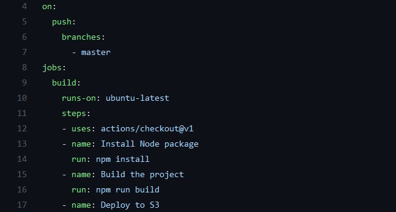
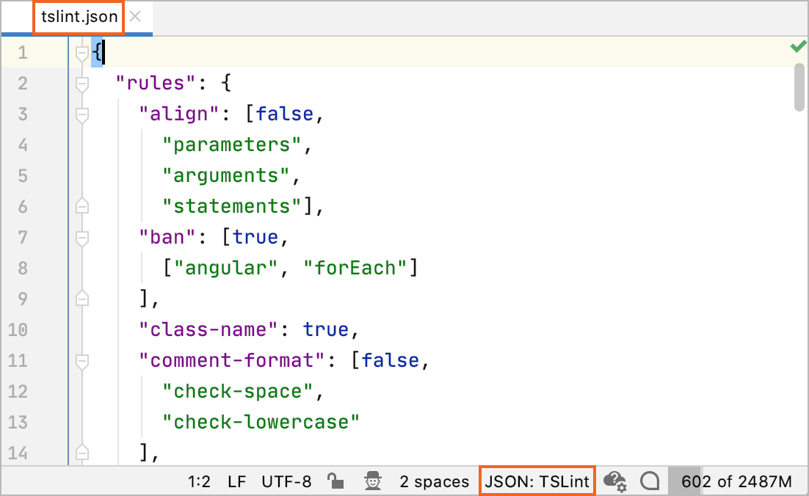

# YAML y JSON
## Índice
**[YAML](#YAML)**, lenguage de serialización.

**[JSON](#JSON)**, lenguage de intercambio de datos.

## YAML


**YAML** es un **lenguaje de serialización** de datos que las personas pueden comprender y suele utilizarse en el diseño de **archivos de configuración**. Para algunas personas, YAML significa otro **lenguaje de marcado más**; para otras, es un acrónimo recursivo que quiere decir "_YAML no es un lenguaje de marcado_", lo que enfatiza la idea de que **se utiliza para los datos**, no para los documentos.
Es un lenguaje popular porque está diseñado para que sea **fácil de leer y entender**. También se puede utilizar junto con otros lenguajes de programación.

> Es un **lenguaje de serialización popular** porque está diseñado para que sea **fácil de leer y entender**. _También se puede utilizar junto con otros lenguajes de programación._

### Sintaxis de YAML



YAML utiliza una extensión de archivos .yml o .yaml y sigue reglas de sintaxis específicas. 

Tiene características que provienen de Perl, C, XML, HTML y otros lenguajes de programación. También se basa en JSON, por lo que los archivos JSON son compatibles con YAML.

No hay símbolos de formato habituales, como llaves, corchetes, etiquetas de cierre o comillas, y los archivos son más sencillos para su lectura, ya que utilizan la sangría al estilo Python para determinar la estructura e indicar la incorporación de un elemento de código dentro de otro. Está diseñado para que no se admitan los caracteres de tabulación y así se mantenga la portabilidad en todos los sistemas, por lo que se usan los espacios en blanco, que son los caracteres de espacio.

Los comentarios se pueden definir con una almohadilla o símbolo numeral (#) y su uso es una práctica recomendada, ya que describen la intención del código. YAML no es compatible con los comentarios que tienen varias líneas, por lo cual el carácter de almohadilla se debe utilizar como sufijo de cada una.

La duda más común entre los principiantes es qué significan los tres guiones (---). Se utilizan para señalar el inicio de un documento mientras que cada uno termina con tres puntos (…).  

**Este es un ejemplo muy básico de un archivo YAML:**

```
#Comentario: esta es una lista de supermercado que utiliza YAML #Nota - el carácter representa la lista --- comida: - vegetales: tomates #primer elemento de la lista - frutas: #segundo elemento de la lista cítricos: naranjas tropicales: bananas nueces: maní dulces: pasas
```

## JSON


**JSON** (_JavaScript Object Notation - Notación de Objetos de JavaScript_) es un **formato ligero de intercambio de datos**. Leerlo y escribirlo es simple para humanos, mientras que para las máquinas es **simple interpretarlo y generarlo**. Está basado en un subconjunto del Lenguaje de Programación _JavaScript, Standard ECMA-262 3rd Edition - Diciembre 1999_.

JSON es un formato de texto que es **completamente independiente** del lenguaje pero utiliza convenciones que son **ampliamente conocidos** por los programadores de la familia de lenguajes C, _incluyendo C, C++, C#, Java, JavaScript, Perl, Python, y muchos otros_.
Estas propiedades hacen que JSON sea un lenguaje ideal para el **intercambio de datos**.

### JSON está constituído por **dos estructuras**:

   * Una **colección de pares de nombre/valor**. En varios lenguajes esto es conocido como un objeto, registro, estructura, diccionario, tabla hash, lista de claves o un arreglo asociativo.
   * Una **lista ordenada de valores**. En la mayoría de los lenguajes, esto se implementa como arreglos, vectores, listas o sequencias.

> Estas son **estructuras universales**; virtualmente todos los lenguajes de programación las soportan de una forma u otra. _Es razonable que un formato de intercambio de datos que es independiente del lenguaje de programación se base en estas estructuras_.




## Webgrafía

[¿Qué es YAML?](https://www.redhat.com/es/topics/automation/what-is-yaml)

[JSON](https://www.json.org/json-es.html)


